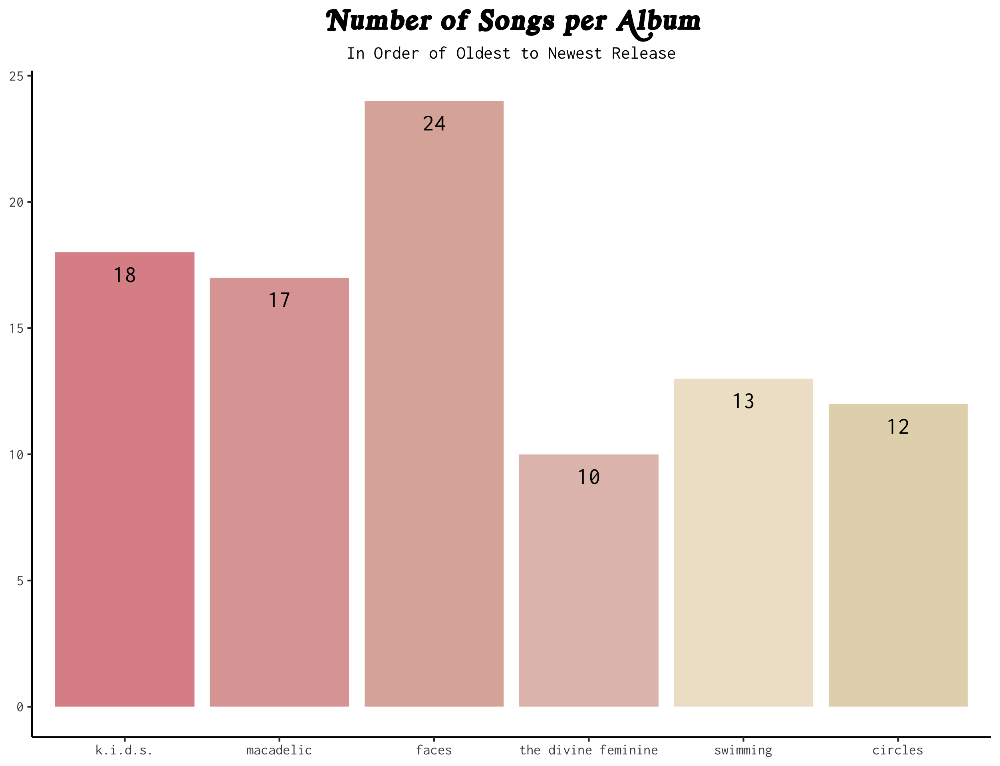
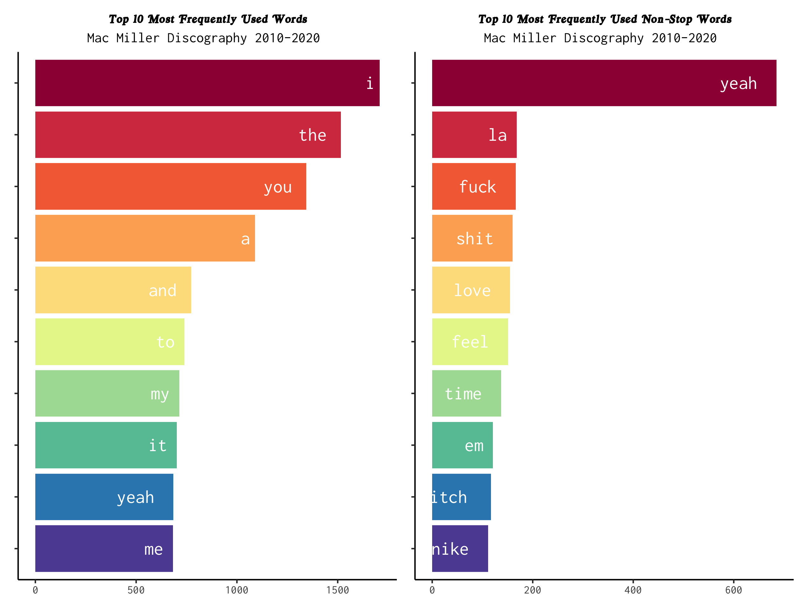

```{=html}
<style type="text/css">
  body{
  font-family: "Inconsolata Black", monospace;
}
</style>
```
```{r global_options, include=FALSE}
library(knitr)
opts_chunk$set(warning=FALSE, message=FALSE, dpi = 300)
```

## Source

```{r}
library(tidyverse)
library(genius)
library(naniar)
```

Collecting and cleaning the data for our project required the three packages displayed above. Using [Josiah Parry's `genius` package](https://github.com/JosiahParry/genius) and the resources provided on his Github, we pulled lyrical data for six projects/albums by late musical artist Mac Miller: Circles, Swimming, The Divine Feminine, Faces, Macadelic, and K.I.D.S.

```{r eval=FALSE}
albums <- tribble(~artist, ~album, ~type,
               "Mac Miller", "Circles", "album",
               "Mac Miller", "Swimming", "album",
               "Mac Miller", "The Divine Feminine", "album",
               "Mac Miller", "Faces", "album",
               "Mac Miller", "Macadelic", "album",
               "Mac Miller", "K.I.D.S.", "album")

mac <- albums %>%
  add_genius(artist, album, type)
```

After some data wrangling and tidying, we ended up with two data frames for our visualization project. `malcolm` has 5709 observations with six variables, which are `album` (character), `track` (numeric), `line` (numeric), `lyric` (character), `song` (character), and `year` (factor). Below is a preview of the first five rows of `malcolm`.

```{r echo=FALSE}
malcolm <- readRDS("data/processed/malcolm.rds") # lyrical data
macaroni <- readRDS("data/processed/macaroni.rds") # word-by-word data

malcolm %>% 
  print(n = 5)
```

However, for ease of analysis, the lyrics are unnested into tokens in the second data frame. `macaroni` contains 46,212 observations with the same data and `word` as its sixth variable instead of `lyric`. Below is a preview of the first five rows of `macaroni`.

```{r echo=FALSE}
macaroni %>% 
  print(n = 5)
```

Having two data frames allows versatility in analysis. By using `malcolm`, we can easily analyze the length (via number of tracks and/or lines) of Mac Miller's albums over time, while `macaroni` allows us to explore popular words and adlibs by album, year, song, etc.

## Why This Data?

We are fans of Mac Miller's work and have an interest in exploring his discography and how his lyrics and artistry may, or may not have, transformed over time. We were inspired by the work of other data scientists who have used data of other musicians to perform text analysis and sentiment analysis followed by visualizations. For example, this project on [TowardsDataScience](https://towardsdatascience.com/how-to-analyze-emotions-and-words-of-the-lyrics-from-your-favorite-music-artist-bbca10411283) and this public [Github](https://github.com/aaumaitre/taylor_swift) repository both piqued our interests. As we are looking at Mac Miller's songs through a novel lens, we hope to gain insight into his artistry.

## Visualizations

```{r eval=FALSE}
library(tidytext)
library(showtext)
library(extrafont)
library(ggthemes)
library(RColorBrewer)
library(ggrepel)
library(patchwork)
```

Our preliminary visualizations required a few different additional packages, listed above. Code for the visualizations below can be viewed in the `eda.R` file.



In this first plot, we learn that the *Faces* album that Mac Miller released had the most amount of songs. The smallest album was *The Divine Feminine*, which has 10 songs. In total, Mac Miller released 94 songs across six projects and albums.



The two side-by-side charts share the top 10 most frequently appearing words in Mac Miller's lyrical data, divided by data that contains stop (filler) words and data that does not contain those words. From these visualizations, we learn that "I" is Mac Miller's most frequent word throughout the lyrical data. For non-stop (non-filler) words, the word "yeah" makes the most frequent appearances, as seen in the graph on the right.

## Potential Challenges

While this is not necessarily a major issue, we think that it will be a challenge for us as budding data scientists to wrangle with the data appropriately, gauge which visualizations are most relevant for the story we are telling, and choosing an aesthetic (and/or aesthetics) that flows well with our narrative of data.

For example, while the barplot above for "top 10 most frequently used words" is aesthetically pleasing, the data presented is not terribly interesting. Sure, Mac Miller does use the "I' pronoun a lot in his lyrics, but so do most other artists writing from a first-person perspective. Another example is the barplot for "number of songs per album". The albums are automatically alphabetized based on default `ggplot` settings, but it could be more insightful to see that plot arranged from most to least song or in chronological order (of release date).

Another potential issue with the data is the missing values, although we do not foresee this being a major problem given that there are only 8 in each data set which is a small proportion of the overall data. Moreover, the missing values aren't actually missing, but rather, pauses in lyricism in a few select songs, i.e. instrumentals and beats.

## Repository

<https://github.com/susantmtran/302final>
