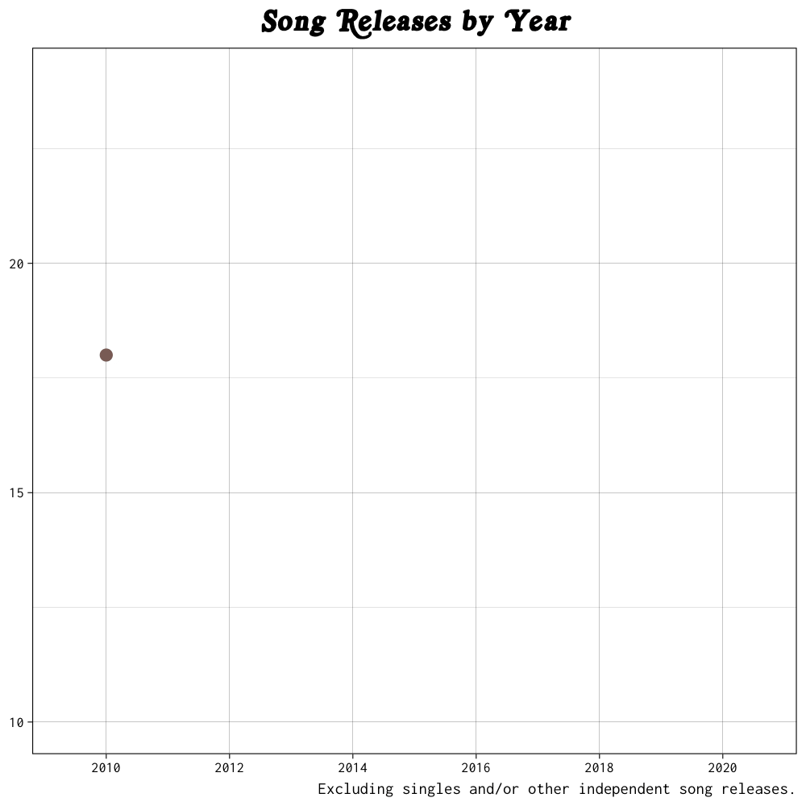

(document is for compiling all of our graphics together into one report; add citation for data; NO CODE)

# Mac Miller's Discography

Our final report is on analyzing.... Our data source is from....

## Breakdown of Mac Miller's Work

**brief explanation here**

**brief explanation here**

## Walking Through the Lyrics

**brief explanation here**

**brief explanation here**

## Interactive App

Link to our app:

(havent published tthe link yet but will do when it is complete)
