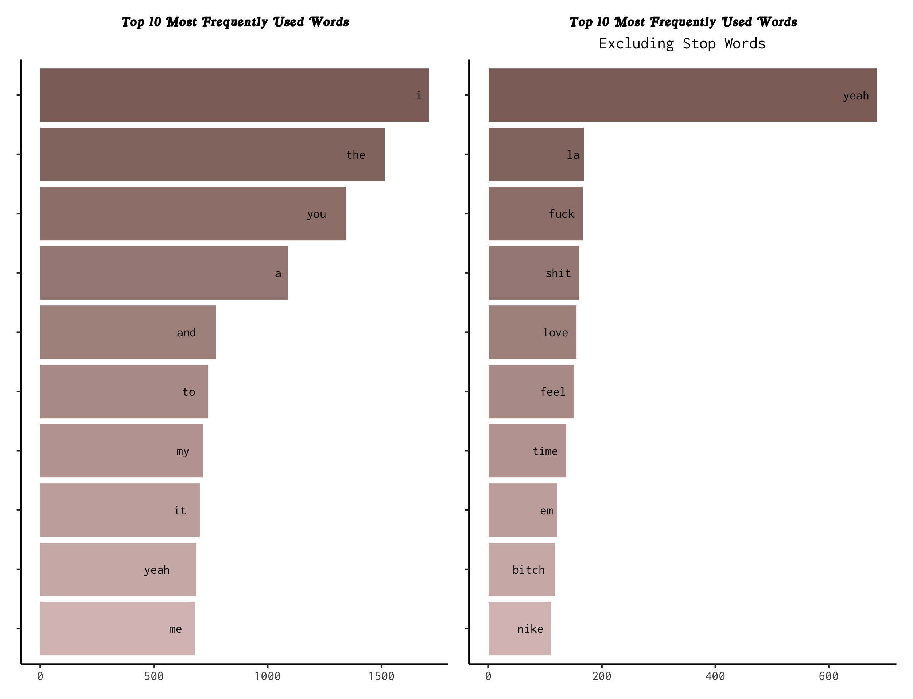
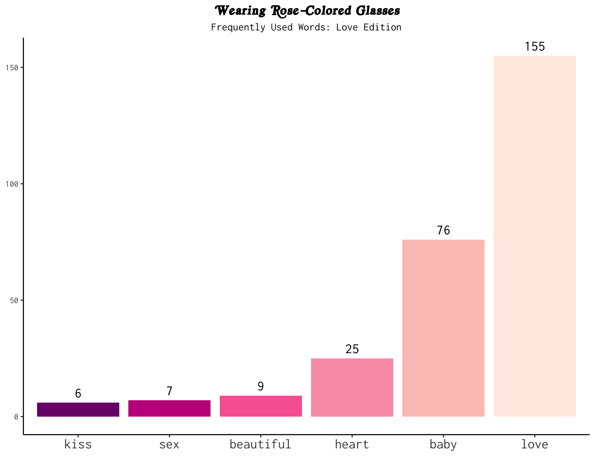
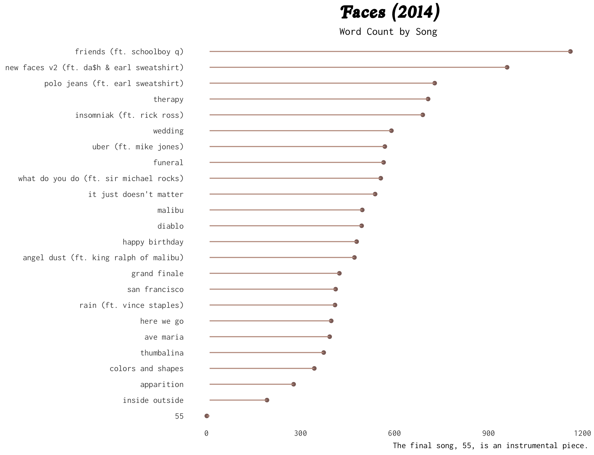

```{r setup, include=FALSE}
knitr::opts_chunk$set(echo = TRUE)
```

```{css echo=FALSE}
body {
  font-family: "Inconsolata Black", monospace; }

*::-webkit-scrollbar {
  width: 10px; }

*::-webkit-scrollbar-track {
  background: #BF9B8E; }

*::-webkit-scrollbar-thumb {
  background-color: #8C6E68;
  border-radius: 20px;
  border: 3px solid #8C6E68; }

a {
  color: #8C6E68 }
  a:hover, a:focus {
    color: #BF9B8E; }

code {
  font-weight: 550;
  color: #8C6E68; }

h1, h2, h3, h4, h5, h6 {
  color: #8C6E68; }

.cover-card {
  text-align: center; }
  
.cover-card .author_name {
  color: #8C6E68;
  font-size: 3em;
  line-height: 100% }
    
.cover-card .author_job {
  color: #D9C1BF;
  font-size: 1em;
  font-weight: 500;
  text-transform: uppercase; }
    
.cover-card .author_bio {
  font-size: 0.75em;
  font-style: italic}

.post-listing {
  width: 80%; }

#post {
  font-size: 0.85em; }
  
#post h2 {
  padding-bottom: 0em;
  border-bottom: thick double #D9C1BF; }
```

## Abstract

Our project reflects a partial analysis of the song lyrics from late musical artist Mac Miller's discography. Throughout his career, Mac Miller released six studio albums, two extended plays, two live albums, and thirteen mixtapes. For the sake of analysis, however, we selected projects that were released in even-numbered years from 2010 to 2020. Using [Josiah Parry's `genius` package](https://github.com/JosiahParry/genius) and the resources provided on Github, we pulled lyrical data for six specific projects: Circles (2020), Swimming (2018), The Divine Feminine (2016), Faces (2014), Macadelic (2012), and K.I.D.S. (2010).

## Over the Years


## Lyric by Lyric








## Interactive App

Click the link [[**here**]{.ul}](https://susantran.shinyapps.io/macmiller/) to open a Mac Miller inspired Shiny App.

## Sources

Mac Miller. *Circles*, Warner Records, 2020.

Mac Miller. *Faces*, Self-released, 2014.

Mac Miller. *K.I.D.S.*, Rostrum, 2010.

Mac Miller. *Macadelic*, Rostrum, 2012.

Mac Miller. *Swimming*, Warner Bros. Records, 2018.

Mac Miller. *The Divine Feminine*, Warner Bros. Records, 2016.

"Mac Miller." Wikipedia, Wikimedia Foundation, Inc., 27 May 2021, en.wikipedia.org/wiki/Mac_Miller.

Parry, Josiah. "Genius," *Github*. 2019. [<https://github.com/JosiahParry/genius>](https://github.com/JosiahParry/genius){.uri}

Veas, Cristobal. "How to Analyze Emotions and Words of the Lyrics From Your Favorite Music Artist." *Medium*, Towards Data Science, 25 Sept. 2020, towardsdatascience.com/how-to-analyze-emotions-and-words-of-the-lyrics-from-your-favorite-music-artist-bbca10411283.
